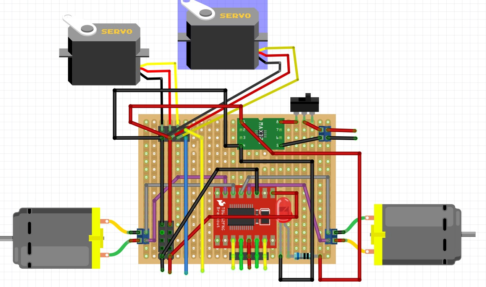

# 树莓派视觉小车

基于树莓派4，集成MG996R舵机、USB摄像头和DRV8833电机驱动的4WD视觉小车。


## 功能

WIFI控制树莓派小车
* 前后，左右运动
* 摄像头上下，左右转动


## 元件

* 树莓派：4B 1个
* 电机驱动模块：DRV8833 1个
* USB摄像头：1920*1080,USB3.0,RER-USB1080P01-LS29 1个 
* MG996R舵机：2个
* MR996舵机双自由度支架
  * 长U支架，1个
  * L型支架，1个
  * 多功能支架，2个
  * 舵盘：25T标准舵盘，2个
  * 法兰轴承:F693ZZ,内3外8厚4，1个
* 双层4WD小车套件：1个(含底盘，4个TT电机)
* LED: 5mm ,红色 1个
* 电阻：680Ω，1个
* 电池：
  * 7.4V 7000mAh航模锂电池
  * 2*18650电池（含电池盒）
* DC-DC降压稳压模块:
  * 迷你降压模块AJ38, 9V/12V/24V/36V固定输出5V, 3A
  * USB输出降压模块，DC-DC,9V/12V/24V/36V转5V, 3A
* 万用板：5x7CM，单面玻纤 1个
* 排针，排座：若干
* 接线端子：KF301-2P,3个
* 尼龙柱：M2.5，4个
* 铜柱：M3*20，14个
* 螺丝、螺母：M3，M2,若干

## 驱动板

* 模块
  * DRV8833
  * 固定输出5V降压稳压电源模块
* 2个舵机接入4P排针
* 5P排座：DRV8833信号接入 
* 电源排针和排座 - 接入/输出5V电源
  * 1P排针 x2
  * 4P排座 x4



## 小车连线


### Raspberry Pi


### Servo

```python
vertical_servo=Servo(18,90)     #  黄色线
horizontal_servo=Servo(19,80) #   蓝色线
```


### DRV8833

```python
class Motor:
   def __init__(self,AIN1,AIN2,BIN1,BIN2):

motor = Motor(5,6,27,17)
```

* SYNB 3.3V Pin1  红色
* GPIO 5  黄色
* GPIO 6  绿色
* GPIO 27 绿色
* GPIO 17 黄色


## 软件包

### USB摄像头
```bash
sudo apt-get install libopencv-dev
sudo apt-get install python3-opencv
```
### Flask框架
```bash
sudo pip3 install -U Flask
```
### pigpio库
```bash
sudo apt-get install pigpio python3-pigpio
```

## 开机运行

### 运行pigpio库

```bash
sudo nano /etc/rc.local
```
在`rc.local`中加命令：运行pigpio库

```bash
sudo pigpiod
```

### 开机运行小车

配置代码的运行权限

```bash
sudo chmod 777 /home/your_name/your_dir/pi-vision-car/webapp/app_vision_car.py 
```
在`rc.local`中加命令运行webapp

```bash
/home/your_name/.local/bin/flask --app /home/your_name/your_dir/webapp/app_vision_car run --host=0.0.0.0 &
```